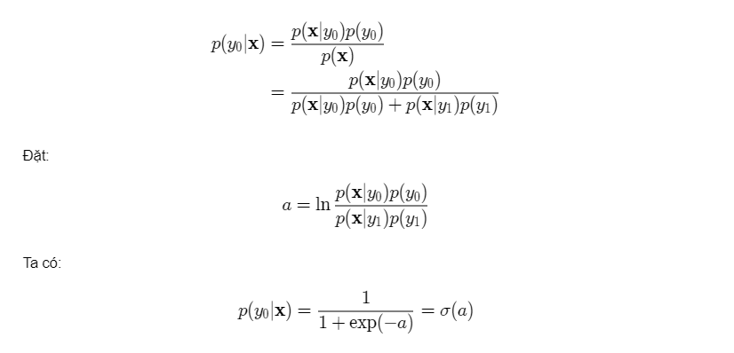
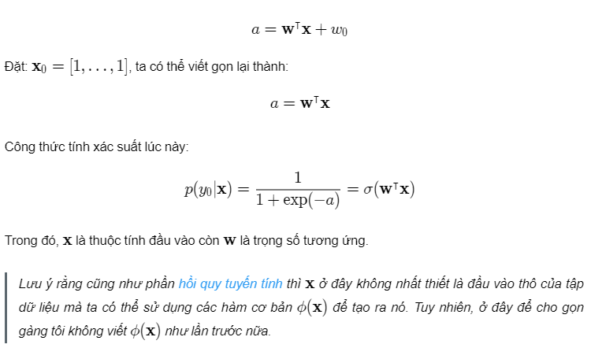
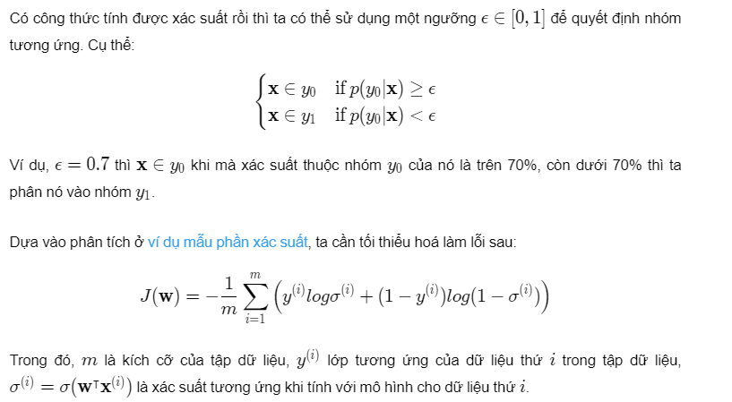
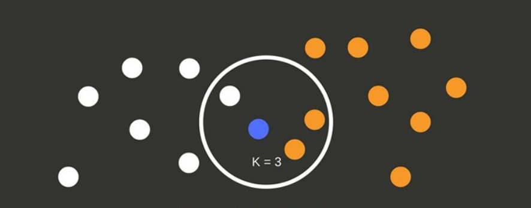
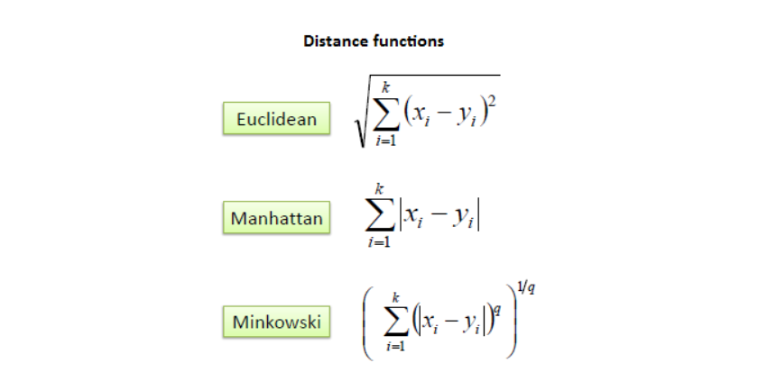

```{r setup, include=FALSE}
knitr::opts_chunk$set(echo = TRUE, warning = FALSE, message = FALSE)
library(dplyr)
library(kableExtra)
library(tidyverse)
library(caret)
library(gridExtra)
library(gtable)
library(GGally)
library(ROCR)
```

## Tóm tắt bài toán cần giải quyết:

Để giúp Charles Book Club (CBC) giải quyết vấn đề lợi nhuận bị thu hẹp, chúng ta sẽ  xây dựng mô hình dự đoán nhằm đánh giá xu hướng mua bản phát hành sách mới của một thành viên. Sau đó, chúng ta tận dụng những điều đã học được trong quá trình huấn luyện mô hình của chúng ta để kiểm tra các mô hình và triển khai các đề xuất để thực hiện hành động đối với các kết quả học được. Chúng ta đưa ra ý tưởng nhằm tập trung nỗ lực marketing khách hàng mới bằng cách sử dụng sở thích liên quan đến các danh mục có ảnh hưởng và kế hoạch giảm ngân sách tổng thể được sử dụng để marketing bản phát hành sách mới cho khách hàng trong cơ sở dữ liệu. Ngoài ra chúng ta còn đề xuất các kế hoạch để cải thiện mô hình và tận dụng quy trình cho các bản phát hành bổ sung.

## Giới thiệu và tìm hiểu vấn đề:

#### Nền tảng kinh doanh của CBC:

- Câu lạc bộ Sách Charles (CBC) là nhà phân phối sách sở hữu một câu lạc bộ sách với một số lượng lớn thành viên. Họ bán sách bằng cách sử dụng marketing trực tiếp thông qua nhiều kênh khác nhau, bao gồm quảng cáo trên phương tiện truyền thông (TV, tạp chí, báo) và gửi mail. Mặc dù CBC không xuất bản bất kỳ cuốn sách nào, nhưng họ đã xây dựng một cơ sở dữ liệu hoạt động của 500.000 người đăng ký. Khi đăng ký câu lạc bộ, các thành viên cung cấp thông tin để hỗ trợ, CBC phát triển lợi thế cạnh tranh với các nhà phân phối khác bằng cách cung cấp các lựa chọn được cá nhân hóa cho các thành viên.

#### Vấn đề kinh doanh và giải pháp phân tích

- Mỗi tháng CBC gửi thư đến tất cả các thành viên có trong cơ sở dữ liệu để cung cấp thông tin về các chương trình khuyến mại mới nhất của CBC cho các thành viên. Họ đã thu về những hiệu quả nhất định trong việc kinh doanh với một số chỉ số nhất định như số lượng thành viên, doanh thu nhưng lợi nhuận kinh doanh sau thuế đang giảm dần bởi vì họ tốn quá nhiều tiền cho việc gửi thư hàng loạt.

- Bộ phận marketing của CBC muốn xem liệu dữ liệu khách hàng có thể được sử dụng để giảm chi phí hoạt động marketing nhằm cải thiện lợi nhuận từ hoạt động marketing của họ hay không. Để thử nghiệm ban đầu về giải pháp phân tích dự đoán, CBC đã quyết định tập trung vào những khách hàng thân thiết nhất của mình để chạy thử nghiệm marketing cho bản phát hành cuốn sách mới có tên The Art History of Florence.

- Kết quả của thử nghiệm có thể được sử dụng để tăng hiệu quả của các bước khác nhau của phễu marketing:

  - [Nghiên cứu khách hàng]
    - Dựa trên mẫu thành viên được sử dụng trong bài phân tích, hãy tập trung trả tiền cho những quảng cáo có nội dung liên quan đến khách hàng tiềm năng dựa trên phân tích sở thích chung và phân loại của các thành viên phản hồi bài kiểm tra (mua sách trong vòng 30 ngày).
    - MỤC TIÊU: tăng tỷ lệ chuyển đổi quảng cáo có trả tiền cho việc mua lại thành viên mới.
    
  - [Dự đoán thành viên]
    - Phát triển mô hình phân tích dự đoán để dự đoán điểm số xu hướng mua bản phát hành sách mới của một thành viên. Sau đó, điểm số xu hướng sẽ được sử dụng để chọn những khách hàng có nhiều khả năng mua bản phát hành mới nhất.
    - MỤC TIÊU: tăng tỷ lệ chuyển đổi marketing trực tiếp cho những khách hàng thực sự có nhu cầu mua sách. 
    
- Bộ phận marketing có thể sử dụng những kiến thức này để cung cấp cho khách hàng của họ khả năng cá nhân hóa hoạt động marketing theo cách hiệu quả hơn từ góc độ chi phí. Mục tiêu là tăng tỷ lệ chuyển đổi thành viên mới và đang hoạt động trong khi đồng thời giảm chi tiêu marketing của họ.

- Với mục đích của phân tích này, chúng ta sẽ tập trung vào việc tạo mẫu một mô hình dùng để dự đoán khả năng mua sách mới phát hành của cơ sở dữ liệu khách hàng hoàn chỉnh và tối ưu hóa chi phí marketing cho sản phẩm mới (chi phí gửi thư)

- Input : Thông tin mua hàng của khách hàng và một số thông tin liên quan đến lịch sử thói quen mua sách của khách hàng

- Output:  Biến Florence thể hiện khách hàng có mua sách The Art History of Florence hay không


## Dữ liệu:

CBC đã thiết kế  cơ sở dữ liệu khách hàng hoàn chỉnh dựa trên các lĩnh vực bao gồm thông tin nhân khẩu, thông tin liên hệ, phân tích mua hàng và hành vi trong quá khứ. Dữ liệu có sẵn  của chúng ta được liệt kê ở cấp độ khách hàng với các biến được liệt kê trong bảng dưới đây:

```{r features, echo=FALSE}
variables <- c("Seq#","ID#", "Gender", "M", "R", "F", "FirstPurch", "ChildBks",
          "YouthBks", "CookBks", "DoItYBks", "RefBks", "ArtBks", "GeoBks",
          "ItalCook", "ItalAtlas", "ItalArt", "MCode", "RCode", "FCode", 
          "Related Purchase", "Florence","Yes_Florence","No_Florence")
descriptions <- c("So thu tu cua khach hang trong tap du lieu nay",
                  "so thu tu cua khach hang trong co so du lieu day du",
                 "0 = Nam, 1 = Nu ",
                 "Tong so tien chi cho viec mua sach",
                 "So thang ke tu lan cuoi mua sach",
                 "tong so lan mua sach",
                 "So thang ke tu lan mua sach dau tien",
                 "So lan mua quyen sach thuoc the loai tre em",
                 "So lan mua quyen sach thuoc the loai thanh thieu nien",
                 "So lan mua quyen sach thuoc the loai nau nuong",
                 "So lan mua quyen sach thuoc the loai self-help",
                 "So lan mua quyen sach thuoc the loai ho tro ( Atlat,..)",
                 "So lan mua quyen sach thuoc the lai my thuat",
                 "So lan mua quyen sach thuoc the loai dia ly",
                 "So lan mua quyen sach co ten 'Secrets of italian Cooking'",
                 "So lan mua quyen sach co ten 'historical Atlas of Italy'",
                 "So lan mua quyen sach c ten 'Italian Art'",
                 "Duoc tinh dua vao bien M o tren($0-$25 (Mcode =1), @26-$50 (Mcode =2), $51-$100 (Mcode =3), $101-$200 (Mcode= 4), $201 tro len (Mcode =5)",
                 "Duoc tinh dua vao bien R o tren(0-2 thang (Rcode=1), 3-6 thang (Rcode =2), 7 -12 thang (Rcode =3), 13 tro len (Rcode =4)",
                 "Duoc tinh dua vao bien F o tren (1 cuon(Fcode =1), 2 cuon (Fcode =2), 3 cuon tro len (Fcode =3)",
                 "So luong sach co chu de lien quan da mua",
                 "=1 neu co mua sach The Art History of Florence nguoc lai = 0",
                 "=1 neu co mua sach The Art History of Florence nguoc lai =0",
                 "=1 neu khong mua sach The Art History of Florence nguoc lai =0"
                 )
variables.descr <- 
  data.frame(Variables = variables,
             Descriptions = descriptions)
kable(variables.descr, "html") %>%
    kable_styling(bootstrap_options = "striped", full_width = F, position = "left", 
                latex_options = "scale_down")
```

Có vẻ như dữ liệu được cung cấp chủ yếu xoay quanh thông tin mua hàng. Do đó, chúng ta sẽ tập trung vào mô hình dự đoán chủ yếu sử dụng phân tích mua hàng của khách hàng và một số hành vi chung. Vì CBC có sẵn dữ liệu này về từng khách hàng của họ, nên điều này sẽ hữu ích nếu chúng ta có thể vận hành các kết quả của thử nghiệm này.

Các lần lặp lại trong tương lai của giải pháp cho các thử nghiệm trong tương lai có thể bao gồm dữ liệu khách hàng bổ sung như thời gian giữa các lần mua hàng, kênh phân phối ưa thích hoặc vị trí.


## Giải pháp:

### Các thuật toán đã sử dụng:

#### 1.Naive Bayes

- Naive Bayes là một thuật toán phân loại thuộc nhóm Supervised Learning (Học có giám sát) hoạt động dựa trên tính toán xác suất áp dụng định lý Bayes.

- Theo định lý Bayes, ta có công thức tính xác suất ngẫu nhiên của sự kiện $y$ khi biết $x$ như sau:
$P(y|x)=\frac{P(x|y)P(y)}{P(x)}$

- Giả sử ta phân chia 1 sự kiện $X$ thành $n$ thành phần khác nhau $x_1, x_2, \dots, x_n$
- Naive Bayes theo đúng như tên gọi dựa vào một giả thiết ngây thơ rằng $x_1, x_2, \dots, x_n$ là các thành phần độc lập với nhau. Từ đó ta có thể tính được:
$P(x∣y)=P(x_1∩x_2∩⋯∩x_n|y)=P(x1|y)P(x_2|y)…P(x_n∣y)$
- Do đó ta có: $P(y∣x)∝P(y)∏P(x_i∣y)$ trong đó $∝$ là phép tỉ lệ thuận và i chạy từ 1 đến n.
- Các mô hình thuật toán Naive Bayes: Có 2 mô hình thuật toán Naive Bayes thường sử dụng là: mô hình Bernoulli và mô hình Multinomial.
  - Mô hình Bernoulli:Ở mô hình này, các feature vector là các giá trị nhị phân 0, 1. Công thức tính $P(x_i|y)$ được tính như sau:
    $P(x_i∣y)=P(i∣y)×x_i+(1−P(i∣y))×(1−xi)$ với $P(i|y)$ là tỉ lệ số lần từ $x_i$ xuất hiện trong toàn bộ tập training data có nhãn y.
  - Mô hình Multinomial: Ở mô hình này, các feature vector là các giá trị số tự nhiên.Công thức tính $P(x_i|y)$ được tính như sau:
    $P(x_i∣y)=\frac{N_i}{N_c}$. Trong đó: $N_i$ là tổng số lần từ $x_i$ xuất hiện. $N_c$ là tổng số lần $x_1,\dots,x_n$ xuất hiện.

#### 2.Logistic Regression:

- Phương pháp hồi quy logistic là một mô hình hồi quy nhằm dự đoán giá trị đầu ra rời rạc (discrete target variable) $y$ ứng với một véc-tơ đầu vào $x$. Việc này tương đương với việc phân loại các đầu vào $x$ vào các nhóm $y$ tương ứng.

- Sử dụng phương pháp thống kê ta có thể coi rằng khả năng một đầu vào $x$ nằm vào một nhóm $y_0$ là xác suất nhóm $y_0$ khi biết $x: p(y_0|x)p(y ∣x)$. Dựa vào công thức xác xuất hậu nghiệm ta có:
```{r, fig.align="center", echo=FALSE}
library(knitr)

```
- Hàm $σ(a)$ ở đây được gọi là hàm sigmoid (logistic sigmoid function). Hình dạng chữ S bị chặn 2 đầu của nó rất đặt biệt ở chỗ dạng phân phối đều ra và rất mượt.
- Vận dụng thuyết phân phối chuẩn, ta có thể chỉ ra rằng:
```{r, fig.align="center", echo=FALSE}
library(knitr)


```


#### 3.K-Nearest Neighbors
- KNN là một trong những thuật toán supervised-learning đơn giản nhất (mà hiệu quả trong một vài trường hợp) trong Machine Learning. Khi training, thuật toán này không học một điều gì từ dữ liệu training (đây cũng là lý do thuật toán này được xếp vào loại lazy learning), mọi tính toán được thực hiện khi nó cần dự đoán kết quả của dữ liệu mới. K-nearest neighbor có thể áp dụng được vào cả hai loại của bài toán Supervised learning là Classification và Regression. KNN còn được gọi là một thuật toán Instance-based hay Memory-based learning.
- Trong bài toán Classification, label của một điểm dữ liệu mới (hay kết quả của câu hỏi trong bài thi) được suy ra trực tiếp từ K điểm dữ liệu gần nhất trong training set. Label của một test data có thể được quyết định bằng major voting (bầu chọn theo số phiếu) giữa các điểm gần nhất, hoặc nó có thể được suy ra bằng cách đánh trọng số khác nhau cho mỗi trong các điểm gần nhất đó rồi suy ra label
```{r, fig.align="center", echo=FALSE}
library(knitr)

```

- Khoảng cách trong không gian vector:
  - Trong không gian một chiều, việc đo khoảng cách giữa hai điểm đã rất quen thuộc: lấy trị tuyệt đối của hiệu giữa hai giá trị đó. Trong không gian hai chiều, tức mặt phẳng, chúng ta thường dùng khoảng cách Euclid để đo khoảng cách giữa hai điểm. Khoảng cách này chính là cái chúng ta thường nói bằng ngôn ngữ thông thường là đường chim bay. Đôi khi, để đi từ một điểm này tới một điểm kia, con người chúng ta không thể đi bằng đường chim bay được mà còn phụ thuộc vào việc đường đi nối giữa hai điểm có dạng như thế nào nữa.
```{r, fig.align="center", echo=FALSE}
library(knitr)

```

  
  
### Các độ đo đã sử dụng:
- ROC: là từ viết tắt của Receiver Operating Characteristics, là độ đo để đánh giá mô hình được tính bằng diện tích phần dưới đường cong ROC vẽ từ TPR và FPR theo từng điểm cutpoint khác nhau 
- AUC:là từ viết tắt của Area Under The Curve biểu diễn mức độ phân loại của mô hình 
$AUC = P(score(x+) > score(x-))$
- TPR: tỉ lệ dương tính đúng, cho biết mức độ dự báo chính xác trong nhóm sự kiện positive
$TPR = \frac{TP}{TP + FN}$
- FPR: tỉ lệ dương tính sai, cho biết mức độ dự báo sai một sự kiện khi nó là negative nhưng kết luận là positive 
$FPR= \frac{FP}{TN + FP}$


## Phân tích thăm dò(EDA):

#### 1. Đọc dữ liệu đầu vào:

Đầu tiên, chúng ta tải vào tập dữ liệu được cung cấp và chuyển đổi các biến phân loại thành các factor vector.

```{r}
data <- read_csv("../Data/CharlesBookClub.csv")

# Tạo các biến phân loại và đổi các biến phân loại thành kiểu factor 
data$Gender <- factor(data$Gender, labels = c("Male", "Female"))
data$Mcode  <- factor(data$Mcode,
                       labels = c("$0-25", "$26-50", "$51-100", "$101-200", "$201+"),
                       ordered = TRUE)
data$Rcode  <- factor(data$Rcode,
                       labels = c("0-2 months", "3-6 months", "7-12 months", "13+ months"),
                       ordered = TRUE)
data$Fcode  <- factor(data$Fcode,
                       labels = c("1 book", "2 books", "3+ books"),
                       ordered = TRUE)

# Cập nhâp tên của từ khóa F để tránh nhầm lẫn với từ khóa False
data <- data %>% rename(Fr = `F`)

# Xóa những cột không cần thiết 
data <- data %>%
  select(-`Seq#`, -`ID#`, -Yes_Florence, -No_Florence) %>%
  select(-Florence, everything()) # chuyển cột Florence thành cột sau cùng
data

```

#### 2. Phân tích thăm dò(EDA)

- Đầu tiên, chúng ta dùng một hàm summary để liệt kê các thống kê liên quan đến phân bố của dữ liệu , từ đó lên kế hoạch xử lý dữ liệu và giải quyết các giá trị outliers(giá trị ngoại biên) hoặc các giá trị bị thiếu.
  - Các biến định lượng:
```{r}
quantity_summary <- function(data, cols = NULL) {

  if (is.null(cols)) {
    num.cols <- colnames(select_if(data, is.numeric))
  } else {
    num.cols <- cols
  }

  data <- data %>% select(num.cols)

    data.summmary <- data.frame(
      Count = round(sapply(data, length), 3),
      MissingValue = round((sapply(data, function(x) sum(length(which(is.na(x)))) / length(x)) * 100), 3),
      Unique = round(sapply(data, function(x) length(unique(x))), 3),
      Min. = round(sapply(data, min, na.rm = TRUE), 3),
      `25 perc.` = round(sapply(data, function(x) quantile(x, 0.25, na.rm = TRUE)), 3),
      Median = round(sapply(data, median, na.rm = TRUE), 3),
      Mean = round(sapply(data, mean, na.rm = TRUE), 3),
      `75 perc.` = round(sapply(data, function(x) quantile(x, 0.75, na.rm = TRUE)), 3),
      Max = round(sapply(data, max, na.rm = TRUE), 3),
      `Std.` = round(sapply(data, sd, na.rm = TRUE), 3)
    ) %>%
      rename(`1st Qrt.` = X25.perc.,
             `3rd Qrt.` = X75.perc.,
             `Miss Pct.` = MissingValue)

    return(data.summmary)
}

data.summary<- quantity_summary(data = data)

# Hiển thị ra bảng cho dễ nhìn
kable(data.summary, type = "html") %>%
  kable_styling(bootstrap_options = "striped", full_width = F, position = "left", 
                latex_options = "scale_down")

```

    - Chúng ta không có bất kỳ giá trị nào bị thiếu. Tuy nhiên có khá nhiều biến có giá trị ngoại biên như R, FirstPurch, ChildBks,... điều này lại không quá ảnh hưởng đến kết quả của mô hình khi giá trị của các biến này không quá vô lý, ngược lại còn có thể cho ta thấy những cơ hội kinh doanh từ các khách hàng đã lâu năm hoặc các khách hàng đặc biệt yêu thích một chủ đề nào đó.
    
    - Sử dụng giá trị trung bình Florence, chúng ta có thể thấy tỷ lệ mua sách của mẫu là 8.4%. Chúng ta có thể thấy tập dữ liệu bao gồm các thành viên đã mua hàng của CBC trong 2 đến 36 tháng qua, mua tổng số sách từ 1 đến 12 và đã chi tổng cộng từ $15 đến $479 cho sách.

    - Tỉ lệ mua The Arf History of Florence của mẫu rất thấp, điều này cho thấy vấn đề mà chúng ta đề cập ở trên là hoàn toàn chính xác khi CBC phải trả chi phí để gửi mail cho 4000 khách hàng thì trong đó chỉ có 8.4% khách hàng mua sản phẩm mới phát hành của họ. Điều này chính là lý do giải thích cho việc mặc dù lượng khách hàng tăng nhưng lợi nhuận sau thuế của CBC đang sụt giảm theo thời gian. Chúng ta cần có một giải pháp để không lãng phí quá nhiều tiền cho việc tiếp thị.

  - Các biến phân loại:
```{r}
category_summary <- function(data, cols = NULL) {

  if (is.null(cols)) {
    cat.cols <- colnames(select_if(data, is.factor))
  } else {
    cat.cols <- cols
  }

  data <- data %>% select(cat.cols)

  category.summary <- data.frame(
     Count = round(sapply(data, length), 2),
     Miss = round(sapply(data, function(x) sum(length(which(is.na(x)))) / length(x)), 3),
     Card. = round(sapply(data, function(x) length(unique(x))), 3),
     Mode = names(sapply(data, function(x) sort(table(x), decreasing = TRUE)[1])),
     Mode_Freq = sapply(data, function(x) sort(table(x), decreasing = TRUE)[1]),
     Mode_pct = round((sapply(data, function(x) sort(table(x), 
                                                   decreasing = TRUE)[1] / length(x)) * 100), 1),
     Mode_2 = names(sapply(data, function(x) sort(table(x), decreasing = TRUE)[2])),
     Mode_Freq_2 = sapply(data, function(x) sort(table(x), decreasing = TRUE)[2]),
     Mode_pct_2 = round((sapply(data, function(x) sort(table(x), 
                                                     decreasing = TRUE)[2] / length(x)) * 100), 1)
       )

  category.summary$Mode <- gsub("^.*\\.","", category.summary$Mode)
  category.summary$Mode_2 <- gsub("^.*\\.","", category.summary$Mode_2)

  category.summary <- category.summary %>% 
    rename(`Miss Pct.` = Miss,
           `Mode Freq.` = Mode_Freq, 
           `Mode Pct.` = Mode_pct,
           `2nd Mode` = Mode_2,
           `2nd Mode Freq.` = Mode_Freq_2, 
           `2nd Mode Pct.` = Mode_pct_2
           )

    return(category.summary)
}

category.summary <- category_summary(data = data)
# hiển thị
kable(category.summary, type = "html") %>%
  kable_styling(bootstrap_options = "striped", full_width = F, position = "left", 
                latex_options = "scale_down")
```
  
    - Tương tự chúng ta cũng không có bất kỳ một giá trị phân loại nào bị trống, dựa vào bảng tóm tắt trên có thể nói khách hàng tiềm năng của CBC chủ yếu là nữ khi có tới 70.4% khách hàng trong tập dữ liệu trên là nữ.Những khách hàng này được cho là khách hàng tiềm năng vì thế dễ hiểu khi phần lớn họ chi tiêu khá nhiều cho việc mua sách cũng như là mua khá nhiều sách của CBC.
    
    - Chúng ta sẽ không thực hiện phân tích quá sâu hoặc đưa ra các kết luận từ phân tích thăm dò trên tập này để đảm bảo tính khách quan cho việc xây dựng mô hình dựa trên một mẫu mà thay vào đó ta nên dựa vào tập train để phân tích và thu thập các thông tin hữu ích.

#### 3. Phân vùng dữ liệu:

- Đối với mục đích lập mô hình, chúng ta sẽ chia tập dữ liệu của mình thành tập train để phát triển mô hình dự đoán, tập validation để so sánh hiệu suất của các mô hình khác nhau và cuối cùng là tập test để ước tính hiệu suất của mô hình đã chọn để triển khai.

- Chúng ta sẽ sử dụng tỉ lệ 70/30 train/test, để thực hiện bước so sánh hiệu suất ta dùng phương pháp k-fold crossvalidation với k = 5

```{r}
set.seed(123)
#Đầu tiên chuyển biến Florence về biến factor
data$Florence <- factor(data$Florence, labels = c("No", "Yes"))

# Chia dữ liệu theo tỉ lệ train/test là 80/20
trainIndex <- createDataPartition(data$Florence, p = .7, 
                                  list = FALSE, 
                                  times = 1)

# Phân vùng dữ liệu
data.train <- data[trainIndex, ]
data.test <- data[-trainIndex, ]
```

- Dể đảm bảo rằng việc lấy mẫu của chúng ta không quá thiên vị, chúng ta cần đảm bảo tính đại diện của các tập train/test cho các nhóm khách hàng khác nhau. Tức là tỉ lệ mua/không mua sách mới phát hành của các mẫu này không được quá chênh lệch so với tập dữ liệu mà ta có 8-9%.

```{r}
prop.table(table(data.train$Florence))
#prop.table(table(data.valid$Florence))
prop.table(table(data.test$Florence))
```

- Tỉ lệ mua sách của các tập train/test là tương đối gần so với tập dữ liệu ta có.

#### 4. Phân tích thăm dò trên tập dữ liệu train:

- Sau khi phân vùng dữ liệu , ta thực hiện các tóm tắt thống kê để xác định các cơ hội trong việc phát triển một mô hình dự đoán dựa trên tập train

```{r}
train.quantity.summary<-quantity_summary(data = data.train)
train.category.summary<-category_summary(data = data.train)
kable(train.quantity.summary, type = "html") %>%
  kable_styling(bootstrap_options = "striped", full_width = F, position = "left", 
                latex_options = "scale_down")
kable(train.category.summary, type = "html") %>%
  kable_styling(bootstrap_options = "striped", full_width = F, position = "left", 
                latex_options = "scale_down")
```

    - Tổng số tiền chi tiêu chi việc mua sách trung bình là vào khoảng 209$
    - Lần mua sách cuối cùng cách đây trung bình khoảng 1 năm
    - Tổng số sách trung bình mà 1 khách hàng mua là khoảng 4 quyển

  - Với việc Florence là biến phản hồi của chúng ta, chúng ta có thể xem xét tỉ lệ mua/không mua của các lớp khách hàng khác nhau để có ý tưởng ban đầu về những biến nào có thể phù hợp nhất để phân biệt giữa người mua và không mua sách mới. 
  - Fr, ArtBks và Related Purchases là những biến có tiềm năng nhất vì nó có liên quan đến thói quen và sở thích mua hàng của một khách hàng
  
```{r}
train.florence <- data.train %>%
  select(-Gender, -Mcode, -Rcode, -Fcode) %>%
  group_by(Florence) %>%
  summarize_all(funs(mean = mean))

florence.mean.table <- t(train.florence) %>%
  `colnames<-`(.[1, ])

florence.mean.table <- data.frame(florence.mean.table[-1, ])


kable(florence.mean.table, type = "html") %>%
  kable_styling(bootstrap_options = "striped", full_width = F, position = "left", 
                latex_options = "scale_down")
```

- Kiểm tra xem sự khác biệt giữa các biến có thực sự ảnh hưởng đến quyết định mua/không mua của khách hàng hay không:
  - Mặc dù điều này là không nhất thiết phải có nhưng nó sẽ cung cấp những thông tin hữu ích cho bộ phận marketing về mặt quyết định mua/không mua của khách hàng của các lớp khách hàng khác nhau có khác nhau về mặt thống kê hay không.
  
  - ở đây chúng ta dùng kiểm định t-test statistic với null hypothesis là giá trị của các thuộc tính nhất định của người mua hoặc không mua The Art History of Florence là như nhau.

```{r}
florence.mean <- data.train %>%
  select(-Gender, -Mcode, -Rcode, -Fcode)

categories <- colnames(florence.mean[ , -16])

florence.ttest <- data.frame(Category = categories, 
                                 p_value = rep(0,15))


for (i in 1:nrow(florence.ttest)) {

  var <- categories[i]
  
  p <- t.test(get(var) ~ Florence, data = florence.mean)$p.value
  
  florence.ttest[i, 2] <- round(p, 4)
}

kable(florence.ttest, type = "html") %>%
  kable_styling(bootstrap_options = "striped", full_width = F, position = "left", 
                latex_options = "scale_down")
```

  - Ta có thể thấy p.value tương ứng cho 2 danh mục ArtBks và Related Purchase gần như bằng 0, điều này đưa ra bằng chứng mạnh mẽ rằng những người mua nhiều sách nghệ thuật và các quyển sách có chủ đề liên quan thì có khả năng cao sẽ mua The Art History of Florence.

- Trực quan hóa dữ liệu: Recency, Frequency, Monetary
    
  - Đưa ra các thông tin cho bộ phận marketing dựa vào các biến RFM(lần mua gần đây nhất, tổng số lần mua và tổng số tiền chi tiêu.). Các thông tin này có thể đánh giá mức độ tiềm năng của khách hàng đó. Sự gia tăng tần suất mua hàng hoặc số tiền chi tiêu và giảm thời gian kể từ lần cuối mua hàng sẽ giúp tăng doanh số bán hàng cho doanh nghiệp.
  - **Recency: Lần cuối cùng mua hàng**
```{r}
theme_set(theme_classic())
color <- c("#999999", "#E69F00", "#56B4E9", "#009E73", "#F0E442", "#0072B2", "#D55E00", "#CC79A7")

var="R"
xlabel <- variables.descr[variables.descr$Variables == "R", 2]
xmean <- data.summary[which(rownames(data.summary) == var), 7] 
mean.intercept <- paste0(var, "_mean")

data.train %>%
    ggplot(aes_string(x = var, fill = "Florence", color = "Florence")) +
    geom_histogram(aes(y =..density..), binwidth = 3, 
                   position = "identity", alpha = 0.3) +
    geom_density(alpha = 0.4) +
    geom_vline(data = train.florence, 
               aes_string(xintercept = mean.intercept, color = "Florence"),
               linetype = "dashed") +
    labs(title = xlabel, x = "", y = "Density") +
    scale_color_manual(values = c(color[6], color[7])) +
    scale_fill_manual(values = c(color[6], color[7])) +
    theme(legend.position = c(0.9, 0.9)) 

```
  
    - Biểu đồ trên cho thấy một xu hướng lệch trái. Hầu hết khách hàng thực hiện lần mua sách cuối cùng của họ cách đây 12-16 tháng. 
    - Chúng ta thấy người mua bản phát hành mới có xu hướng thực hiện lần mua cuối cùng gần đây hơn những người không mua.

  - **Frequency: Tần suất mua hàng**
```{r}
var="Fr"
xlabel <- variables.descr[variables.descr$Variables == "F", 2]
xmean <- data.summary[which(rownames(data.summary) == var), 7] 
mean.intercept <- paste0(var, "_mean")

data.train %>%
    ggplot(aes_string(x = var, fill = "Florence", color = "Florence")) +
    geom_histogram(aes(y =..density..), binwidth = 1, 
                   position = "identity", alpha = 0.3) +
    geom_density(alpha = 0.4) +
    geom_vline(data = train.florence, 
               aes_string(xintercept = mean.intercept, color = "Florence"),
               linetype = "dashed") +
    labs(title = xlabel, x = "", y = "Density") +
    scale_color_manual(values = c(color[6], color[7])) +
    scale_fill_manual(values = c(color[6], color[7])) +
    theme(legend.position = c(0.9, 0.9)) 

```

    - Biểu đồ trên cho thấy một lượng lớn khách hàng mua The Art History of Florence chỉ mua hàng 1 đến 2 lần trước đó.
    - Những người mua sách này trung bình mua nhiều sách hơn so với người không mua.
  - **Monetary: Chi tiêu cho việc mua sách**
```{r}
var="M"
xlabel <- variables.descr[variables.descr$Variables == var, 2]

xmean <- data.summary[which(rownames(data.summary) == var), 7] 

mean.intercept <- paste0(var, "_mean")

data.train %>%
    ggplot(aes_string(x = var, fill = "Florence", color = "Florence")) +
    geom_histogram(aes(y =..density..), binwidth = 6, 
                   position = "identity", alpha = 0.6) +
    geom_density(alpha = 0.4) +
    geom_vline(data = train.florence, 
               aes_string(xintercept = mean.intercept, color = "Florence"),
               linetype = "dashed") +
    labs(title = xlabel, x = "", y = "Density") +
    scale_color_manual(values = c(color[6], color[7])) +
    scale_fill_manual(values = c(color[6], color[7])) +
    theme(legend.position = c(0.9, 0.9)) 
```
    
    - Chi tiêu trung bình của những người mua và không mua gần như không khác biệt quá nhiều.
    - Mẫu này có dạng phân bố gần với phân phối chuẩn nên có thể đại diện tốt nhất cho nhóm khách hàng tiềm năng.
  - **First Purchase: Lần đầu tiên mua sách**

```{r}
var="FirstPurch"
xlabel <- variables.descr[variables.descr$Variables == var, 2]
xmean <- data.summary[which(rownames(data.summary) == var), 7] 
mean.intercept <- paste0(var, "_mean")

data.train %>%
    ggplot(aes_string(x = var, fill = "Florence", color = "Florence")) +
    geom_histogram(aes(y =..density..), binwidth = 6, 
                   position = "identity", alpha = 0.3) +
    geom_density(alpha = 0.4) +
    geom_vline(data = train.florence, 
               aes_string(xintercept = mean.intercept, color = "Florence"),
               linetype = "dashed") +
    labs(title = xlabel, x = "", y = "Density") +
    scale_color_manual(values = c(color[6], color[7])) +
    scale_fill_manual(values = c(color[6], color[7])) +
    theme(legend.position = c(0.9, 0.9)) 
```

    - Đồ thị trên cho thấy hầu hết các thành viên của câu lạc bộ đã mua sách lần đầu tiên trong vòng 24-36 tháng trở lại đây.
    - Những người không mua trung bình là những khách hàng mới hơn của CBC

- Mức độ tương quan:
```{r}
corr.mat <- data.train %>%
  select(R, Fr, M, FirstPurch, Florence) %>%
  mutate(Florence = ifelse(Florence == "Yes", 1, 0))
ggcorr(corr.mat, label = TRUE)
```

  
  - Không có mối tương quan đơn biến nào chặt chẽ giữa các biến RFM ngoại trừ mối quan hệ giữa thời gian kể từ lần mua đầu tiên và số lần mua sách, điều này không có gì là đáng ngạc nhiên.
  
  - Ma trận tương quan còn cho thấy không có bất kỳ biến nào có mối tương quan chặt chẽ với  biến phản hồi của chúng ta tức là biến Florence, điều này chứng tỏ chúng ta nên sử dụng một mô hình đa biến cho việc dự đoán.

- Phân tích mua hàng:
  - Tiếp theo chúng ta sẽ xem xét mức độ ảnh hưởng của các biến còn lại đến quyết định mua/không mua của một khách hàng bằng cách trực quan hóa dữ liệu.
  - Loại sách đã mua:
```{r}
books <- data.train %>%
  select(contains("Bks"), contains("Ital"), `Related Purchase`, Florence) %>%
  gather(key = "category", value = "count", contains("Bks"), contains("Ital"), `Related Purchase`)

ggplot(books, aes(x = category, y = count, fill = Florence)) +
  geom_boxplot() +
  labs(title = "So luong sach da mua theo the loai", x = "") +
  scale_fill_manual(values = c(color[6], color[7])) +
  theme(axis.text.x = element_text(angle = 45, hjust = 1))
```
    
    Như đã phân tích bằng kiểm định thống kê ở trên, ta thấy sự khác biệt rõ ràng của những người mua và không mua The Art History of Florence ở các thể loại Nghê thuật, thanh thiếu niên và sách tham khảo.
    
  - Ma trận tương quan của tất cả các biến:
```{r}
corr.mat <- data.train %>%
  dplyr::select(-contains("code")) %>%
  mutate(Florence = ifelse(Florence == "Yes", 1, 0),
         Gender = ifelse(Gender == "Female", 1, 0))
ggcorr(corr.mat, label=TRUE, size = 2.5)
```
  
    - Chúng ta nhìn thấy nhiều điều thú vị thông qua ma trận tương quan này, ví dụ như những khách hàng cũ hơn thì thường họ sẽ mua nhiều sách thuộc thể loại nấu nướng, trẻ em hơn. 
    - Không có bất kỳ một biến nào có mối tương quan chặt chẽ với biến phản hồi của chúng ta.
    
## Xây dựng mô hình:

#### 1. Kế Hoạch mô hình hóa:

Để thúc đẩy quá trình xây dựng và lựa chọn mô hình, chúng ta quyết định chọn 3 thuật toán là NaiveBayes, Logistics regression và KNN. Chúng ta sẽ bắt đầu bằng việc lặp lại 2 thuật toán trên với các cấu hình tham số và siêu tham số khác nhau để xác định các mô hình tốt nhất(model selection) trên cơ sở thu được và các đánh giá ROC, AUC, AIC,... Các mô hình được chọn sẽ được sử dụng để đánh giá trên test set trong giai đoạn đánh giá mô hình(evaluation). Mục tiêu của chúng ta là xây dựng mô hình tối đa hóa tỷ lệ người mua hàng khi xếp hạng họ theo xu hướng mua hàng được dự đoán bởi mô hình. Việc phát triển thành công mô hình dự đoán để dự đoán phần lớn người mua hàng(trong phạm vi 70-80% mẫu của chúng ta) sẽ cho phép chúng ta thu được nhiều hiệu quả hơn từ ngân sách marketing của mình bằng cách giảm số lượng khách hàng mà chúng tôi phải marketing để mang lại một lượng doanh thu dự kiến tương tự . Như vậy, do tỷ lệ mua The Art History of Florence rất thấp, chúng ta sẵn sàng hy sinh độ chính xác dự đoán tổng thể của người mua và người không mua kết hợp để dự đoán người mua hiệu quả hơn so với người không mua. Nói cách khác, nếu chúng ta xếp hạng xác suất các thành viên mua sách mới, chúng ta muốn mô hình của mình xếp hạng những người mua thực tế gần với đầu danh sách hơn để chúng ta có thể giảm tổng số khách hàng dự kiến mà chúng tôi phải nhắm mục tiêu cho hoạt động marketing mà cụ thể ở đây là hoạt động gửi thư.

#### 2. Mô hình Naive Bayes

Thuật toán đầu tiên chúng ta sẽ sử dụng là một thuật toán đơn giản để áp dụng trên các biến RFM code và biến giới tính. Sử dụng xác suất có điều kiện của các biến khác nhau kết hợp với biến phản hồi(Florence), chúng ta tính xác suất trở thành người mua của một khách hàng cụ thể. Hơn nữa, chúng ta sẽ sử dụng tham số Laplace để điều chỉnh các trọng số khác nhau nhằm tính đến sự kết hợp của các biến liên quan đến biến phản hồi.

Dưới đây, chúng ta sử dụng 5-fold crossvalidation để tính điểm ROC cho mô hình Naive Bayes ban đầu của chúng ta chọn các cấu hình siêu tham số khác nhau. Chúng ta thấy các siêu tham số khác nhau ít nhiều tạo ra điểm ROC là 0.597.

```{r}

#Xác định phương thức huấn luyện
ctrl <- trainControl(method = "repeatedcv", 
                     number = 5, 
                     classProbs = TRUE, 
                     summaryFunction = twoClassSummary)

#Các biến sử dụng cho mô hình Naive Bayes

nb.vars <- c("Gender", "Rcode","Fcode","Mcode", "Florence")


train.nb <- data.train[ , nb.vars]

levels(train.nb$Mcode)<-c("$0-50","$0-50","$51-100","$101-200","$201+")
# Tạo một mảng các siêu tham số Laplace
nbGrid <-  expand.grid(fL = c(0, 1, 5),
                       usekernel = c(TRUE, FALSE), 
                       adjust = c(0, 0.5, 1.0)
                       )

# train mô hình và tính xác suất priori 
nb.model1 <- train(Florence ~ ., data = train.nb,
             method = "nb",
             metric = "ROC", 
             tuneGrid = nbGrid,
             trControl = ctrl)

nb.model1
```

- Như đã phân tích ở phần EDA, chúng ta sẽ thêm 2 yếu tố ảnh hưởng nhiều đến việc mua The Art of Florence là khách hàng có mua sách thuộc thể loại Nghệ thuật hoặc Địa lý hay không vào mô hình, việc này có thể giúp cải thiện hiệu suất của mô hình

```{r}
data.train$Art_1 <- factor(ifelse(data.train$ArtBks > 0, 1, 0))
data.train$Geo_1 <- factor(ifelse(data.train$GeogBks > 0, 1, 0))

nb2.vars <- c("Gender", "Rcode", "Fcode", "Mcode", "Art_1", "Geo_1", "Florence")
train.nb=data.train[ , nb2.vars]
levels(train.nb$Mcode)<-c("$0-50","$0-50","$51-100","$101-200","$201+")
nb.model2 <- train(Florence ~ ., data =train.nb ,
             method = "nb",
             metric = "ROC", 
             tuneGrid = nbGrid,
             trControl = ctrl)

nb.model2
```

Cuối cùng ta sẽ thêm một biến nhị phân với ý nghĩa rằng khách hàng có mua sách trong 24 tháng vừa qua hay không vào mô hình. Việc này cũng sẽ giúp cải thiện hiệu suất của mô hình.

```{r}
data.train$FirstPurch_2 <- factor(ifelse(data.train$FirstPurch >= 24, 1, 0))

nb3.vars <- c("Gender", "Rcode", "Fcode", "Mcode", "Art_1", "Geo_1", "FirstPurch_2", "Florence")
train.nb=data.train[ , nb3.vars]
levels(train.nb$Mcode)<-c("$0-50","$0-50","$51-100","$101-200","$201+")

# build model and generate a-priori probabilities
nb.model3 <- train(Florence ~ ., data = train.nb,
             method = "nb",
             metric = "ROC", 
             tuneGrid = nbGrid,
             trControl = ctrl)

nb.model3
```


#### 3. Mô hình Logistic Regression:

Thuật toán tiếp theo chúng ta sử dụng sẽ là Logistic Regression . Chúng ta sẽ xây dựng một vài mô hình để so sánh và lựa chọn mô hình tốt nhất bằng cách thử các cấu hình siêu tham số khác nhau với phương pháp k-fold crossvalidation. Mô hình ban đầu của chúng ta sử dụng tất cả các biến ngoại trừ các biến RFM_Code và số lần mua gần đây vì chúng có mức độ tương quan cao với số lượng mua ở một số thể loại cụ thể. Chúng ta loại bỏ chúng để loại bỏ thông tin thừa và hiểu rõ hơn tác động của các biến còn lại.

```{r}
set.seed(1)
#Sử dụng 5-folds crossvalidation để tính điểm ROC
ctrl <- trainControl(method = "repeatedcv", 
                     number = 5, 
                     classProbs = TRUE, 
                     summaryFunction = twoClassSummary)
train.glm <- data.train %>%
  select(-contains("Code"), 
         -contains("_"),
         -`Related Purchase`)
#Build model và tạo ra một chuỗi xác suất priori
glm.models <- train(Florence ~ ., data = train.glm,
                 method = "glm",
                 metric = "ROC",
                 trControl = ctrl)

glm.models
summary(glm.models)
```

- Từ kết quả trên, chúng ta thấy một số biến có ý nghĩa thống kê trong mô hình của chúng ta và các thể loại  Nghệ thuật và Nấu nướng có ảnh hưởng tích cực đến nhu cầu mua hàng trong khi sách tham khảo có tác động tiêu cực. Tần suất mua cũng có tác động lớn hơn đến việc mua sách mới, điều này có ý nghĩa. Nói chung, bạn càng mua nhiều, càng có nhiều khả năng bạn sẽ mua một cuốn sách mới phát hành. Có thể tận dụng những phân tích này để cân nhắc đưa ra một chương trình khách hàng thân thiết cho  người mua hàng thường xuyên.

- ROC Score(AUC) trung bình khoảng 0.6

Ngoài ra, chúng ta có thể thử xem các biến thể khác của logistic  regression  bằng cách sử dụng stepwise selection. Mỗi phương pháp sẽ cố gắng chọn các biến dựa trên ý nghĩa thống kê của chúng đối với việc mua bản phát hành sách mới. Mô hình có performance tốt nhất là logisitic regression với forward & backward stepwise bởi vì ta mong đợi 1 mô hình có AIC nhỏ(Sens lớn và Spec lớn).

```{r}
glm.step <- glm(Florence ~ ., data = train.glm, family = "binomial")
glm.forward <- step(glm.step, direction = "forward", trace = 0)
glm.backward <- step(glm.step, direction = "backward", trace = 0)
glm.both <- step(glm.step, direction = "both", trace = 0)
glm.for.models <- train(glm.forward$formula, data = train.glm,
                 method = "glm",
                 metric = "ROC", 
                 trControl = ctrl)

glm.back.models <- train(glm.backward$formula, data = train.glm,
                 method = "glm",
                 metric = "ROC", 
                 trControl = ctrl)

glm.both.models <- train(glm.both$formula, data = train.glm,
                 method = "glm",
                 metric = "ROC", 
                 trControl = ctrl)
glm.for.models$results
glm.back.models$results
glm.both.models$results
```
Tiếp theo, chúng ta sẽ xem các mô hình trên sử dụng những biến nào để dự đoán từ đó lựa chọn những biến thực sự có ảnh hưởng đến performance của mô hình
```{r}
glm.for.models$finalModel
glm.back.models$finalModel
glm.both.models$finalModel
```

Hai mô hình backward và both cho một giá trị AIC như nhau và giá trị nhỏ hơn AIC của mô hình forward, cộng hưởng với kết quả phân tích ở trên ta chọn mô hình both với các biến Gender, M, R, Fr, ChildBks, YouthBks, CookBks, DoItYBks, ArtBks, GeoBks, ItalArt.

#### 4. Mô hình KNN:

Thuật toán cuối cùng chúng ta sử dụng là KNN, chúng ta sẽ xây dựng một mô hình KNN đơn giản với các biến RFM_Code, Gender, FirstPurch và Relate .Purchase

```{r}
knn.vars<-c("Gender", "Rcode", "Fcode", "Mcode", "FirstPurch","Related Purchase", "Florence")
train.knn <- data.train[ , knn.vars]

knn.models1<-train(Florence ~ ., data = train.knn,
             method = "knn",
             metric = "ROC", 
             tuneGrid=expand.grid(k = 1:15),
             preProcess = c("center", "scale"),
             trControl = ctrl)
knn.models1
```

Như phân tích thống kê ở phần phân tích thăm dò, ta nhận thấy 2 biến ArtBks và GeogBks có ảnh hưởng tích cực đến tỉ lệ mua sách The Art History of Florence. Vì vậy ta thử thêm 2 biến này vào mô hình và xem ROC score của mô hình.

```{r}
data.train$Art_1 <- factor(ifelse(data.train$ArtBks > 0, 1, 0))
data.train$Geo_1 <- factor(ifelse(data.train$GeogBks > 0, 1, 0))
knn.vars<-c("Gender", "Rcode", "Fcode", "Mcode", "FirstPurch","Related Purchase", "Art_1","Geo_1","Florence")
train.knn <- data.train[ , knn.vars]

knn.models2<-train(Florence ~ ., data = train.knn,
             method = "knn",
             metric = "ROC", 
             tuneGrid=expand.grid(k = 1:15),
             preProcess = c("center", "scale"),
             trControl = ctrl)
knn.models2
```

Rõ ràng việc thêm 2 biến này giúp cải thiện ROC Score của mô hình, tiếp theo cũng dựa vào bảng phân tích thống kê ở phần trên, ta sẽ thử biến đổi biến FirstPurch thành biến nhị phân với điều kiện là lần đầu tiên mua hàng của khách cách đây từ 24 tháng trở lên.

```{r}
data.train$FirstPurch_2 <- factor(ifelse(data.train$FirstPurch >= 24, 1, 0))
knn.vars<-c("Gender", "Rcode", "Fcode", "Mcode", "FirstPurch_2","Related Purchase", "Art_1","Geo_1","Florence")
train.knn <- data.train[ , knn.vars]

knn.models3<-train(Florence ~ ., data = train.knn,
             method = "knn",
             metric = "ROC", 
             tuneGrid=expand.grid(k = 1:15),
             preProcess = c("center", "scale"),
             trControl = ctrl)
knn.models3
```

Bảng kết quả trên chứng tỏ viêc biến đổi FirstPurch thành biến nhị phân không giúp chúng ta cải thiện điểm ROC, vì thế ta sẽ chọn mô hình thứ 2.

#### 4.Lựa chọn mô hình:

Dựa vào các kết quả phân tích ở mục 2 và 3, chúng ta sẽ lựa chọn:

- Mô hình Naive Bayes với các biến RFM Code, giới tính và các biến nhị phân liên quan đến việc mua sách Nghệ thuật / Địa lý / Lần mua đầu tiên.

- Mô hình Logistic Regression với công thức như sau: Florence ~ Gender + M + R + Fr + ChildBks + CookBks + DoItYBks + ArtBks + GeogBks + YouthBks + ItalArt và sử dụng biến thể forward & backward stepwise

- Mô hình Knn với công thức như sau: Florence ~ Gender + Rcode + Fcode + Mcode + FirstPurch + Related Purchase + Art_1 + Geo_1 + Florence

#### 5. Kiểm tra hiệu suất của mô hình trên test set:

Dưới đây, chúng ta sẽ chạy các mô hình đã chọn ở trên trên tập test, tính toán ROC Score, đo lường độ chính xác từ đó so sánh hiệu suất của 2 mô hình và chọn ra cách tốt nhất để triển khai mô hình.

- Đầu tiên, chúng ta sẽ đánh giá mô hình Naive Bayes đã chọn bằng cách vẽ đồ thị TPR, FPR và ROC Score trên tập train và test:

```{r}
plot_roc <- function(train_roc, train_auc, test_roc, test_auc) {
  
  plot(train_roc, col = "blue", lty = "solid", main = "", lwd = 2,
       xlab = "False Positive Rate",
       ylab = "True Positive Rate")
  plot(test_roc, col = "red", lty = "dashed", lwd = 2, add = TRUE)
  abline(c(0,1))
  train.legend <- paste("Training AUC = ", round(train_auc, digits = 3))
  test.legend <- paste("Test AUC = ", round(test_auc, digits = 3))
  legend("bottomright", legend = c(train.legend, test.legend),
         lty = c("solid", "dashed"), lwd = 2, col = c("blue", "red"))
  
}

#Xác định các biến dùng với Naive Bayes
nb3.vars <- c("Gender", "Rcode", "Fcode", "Mcode", "Art_1", "Geo_1", "FirstPurch_2", "Florence")

# Xử lý dữ liệu đầu vào cho mô hình trên tập test
data.test$Art_1 <- factor(ifelse(data.test$ArtBks > 0, 1, 0))
data.test$Geo_1 <- factor(ifelse(data.test$GeogBks > 0, 1, 0))
data.test$FirstPurch_2 <- factor(ifelse(data.test$FirstPurch >= 24, 1, 0))

train.nb=data.train[ , nb3.vars]
levels(train.nb$Mcode)<-c("$0-50","$0-50","$51-100","$101-200","$201+")
test.nb=data.test[ , nb3.vars]
levels(test.nb$Mcode)<-c("$0-50","$0-50","$51-100","$101-200","$201+")


# Độ chính xác cho mô hình NaiveBayes tốt nhất trên tập train:
data.train$nb_prob <- predict(nb.model3, newdata = train.nb, type = "prob")[ , 2]
data.train.nb.pred <- prediction(data.train$nb_prob, data.train$Florence)
data.train.nb.auc  <- as.numeric(performance(data.train.nb.pred, "auc")@y.values)
data.train.roc <- performance(data.train.nb.pred, "tpr", "fpr")

# Độ chính xác cho mô hình NaiveBayes tốt nhất trên tập test:
data.test$nb_prob <- predict(nb.model3, newdata = test.nb, type = "prob")[ , 2]
data.test.nb.pred <- prediction(data.test$nb_prob, data.test$Florence)
data.test.nb.auc  <- as.numeric(performance(data.test.nb.pred, "auc")@y.values)
data.test.roc <- performance(data.test.nb.pred, "tpr", "fpr")

# Vẽ đồ thị AUC/ROC
plot_roc(train_roc = data.train.roc,
         train_auc = data.train.nb.auc,
         test_roc = data.test.roc,
         test_auc = data.test.nb.auc)
```

- Tương tự ta cũng thực hiện vẽ biểu đồ AUC/ROC với mô hình KNN tốt nhất đã chọn

```{r}
# Xác định các biến dùng với knn
knn.vars<-c("Gender", "Rcode", "Fcode", "Mcode", "FirstPurch","Related Purchase", "Art_1","Geo_1","Florence")

# Biến đổi các biến trên tập test
data.test$Art_1 <- factor(ifelse(data.test$ArtBks > 0, 1, 0))
data.test$Geo_1 <- factor(ifelse(data.test$GeogBks > 0, 1, 0))

#Tính toán các độ đo liên quan đến ROC trên tập train
data.train$knn_prob <- predict(knn.models2, newdata = data.train[ , knn.vars], type = "prob")[ , 2]
data.train.knn.pred <- prediction(data.train$knn_prob, data.train$Florence)
data.train.knn.auc  <- as.numeric(performance(data.train.knn.pred, "auc")@y.values)
data.train.roc <- performance(data.train.knn.pred, "tpr", "fpr")

#Tính toán các độ đo liên quan đến ROC trên tập test
data.test$knn_prob <- predict(knn.models2, newdata = data.test[ , knn.vars], type = "prob")[ , 2]
data.test.knn.pred <- prediction(data.test$knn_prob, data.test$Florence)
data.test.knn.auc  <- as.numeric(performance(data.test.knn.pred, "auc")@y.values)
data.test.roc <- performance(data.test.knn.pred, "tpr", "fpr")

# vẽ đồ thị ROC/AUC scores
plot_roc(train_roc = data.train.roc,
         train_auc = data.train.knn.auc,
         test_roc = data.test.roc,
         test_auc = data.test.knn.auc)
```

- Tiếp theo, chúng ta sẽ đánh giá mô hình Logistic Regression bằng cách vẽ đồ thị TPR, FPR và ROC Score trên tập train và test:

```{r}
# Công thức dùng cho logistic regression
glm.form<-{Florence ~ Gender + M + R + Fr + ChildBks + CookBks + DoItYBks + ArtBks + GeogBks + YouthBks + ItalArt}

# Tính toán các độ đo liên quan đến ROC trên tập train
data.train$glm_prob <- predict(glm.both.models, newdata = data.train, type = "prob")[ , 2]
data.train.glm.pred <- prediction(data.train$glm_prob, data.train$Florence)
data.train.glm.auc  <- as.numeric(performance(data.train.glm.pred, "auc")@y.values)
data.train.glm.roc <- performance(data.train.glm.pred, "tpr", "fpr")

# Tính toán các độ đo liên quan đến ROC trên tập test
data.test$glm_prob <- predict(glm.both.models, newdata = data.test, type = "prob")[ , 2]
data.test.glm.pred <- prediction(data.test$glm_prob, data.test$Florence)
data.test.glm.auc  <- as.numeric(performance(data.test.glm.pred, "auc")@y.values)
data.test.glm.roc <- performance(data.test.glm.pred, "tpr", "fpr")

# vẽ đồ thị ROC/AUC scores
plot_roc(train_roc = data.train.glm.roc,
         train_auc = data.train.glm.auc,
         test_roc = data.test.glm.roc,
         test_auc = data.test.glm.auc)
```

  - Với tỉ lệ mua trung bình là 8% - một con số rất thấp, tức là hiệu suất marketing đang rất thấp và số tiền lãng phí đang rất cao. Chính vì thể ở đây ta mong muốn "bỏ sót còn hơn đoán nhầm" , ta kỳ vọng một giá trị AUC cao để kéo FPR cao lên và TPR thấp xuống.
  
  - Với mô hình Knn, ta thấy nó tương đối hiệu quả với tập train tuy nhiên lại kém hiệu quả với tập test, điều này cũng chứng tỏ mô hình này có sai số rất biến động tùy theo cách chúng ta lấy mẫu.Điều này tạo ra rủi ro rất lớn nếu chúng ta triển khai nó trên thực tế. Có thể đã xảy ra hiện tượng overfitting trên tập train, chúng ta có thể cải thiện bằng cách sử dụng k-fold crossvalidation với k nhỏ hơn hoặc chia trực tiếp tập validation từ tập dữ liệu gốc.
  
  - Với mô hình logistic regression, sự chênh lệch hiệu suất trên 2 tập dữ liệu là tương đối nhỏ, nhưng điểm AUC trung bình không quá cao ở mức 0.64.
  
  - Với mô hình Naive Bayes AUC trung bình là khá thấp, thấp hơn Logistic Regression, tuy nhiên độ chính xác của nó không quá chênh lệch trên 2 tập train và test
  
## Kết quả cuối cùng:

Sau khi xem xét hiệu suất của các mô hình trên tập test , chúng ta thấy mô hình hồi quy logistic hoạt động tốt hơn 2 mô hình còn lại và cung cấp cho chúng ta cơ hội giảm ngân sách marketing trực tiếp bằng cách nhắm mục tiêu các thành viên được dự đoán là có nhiều khả năng mua bản phát hành sách mới nhất.

Về các yếu tố dự đoán, chúng ta thấy rằng nam giới có nhiều khả năng mua hàng hơn nữ giới, việc mua sách thuộc các thể loại như Nghệ thuật và Địa lý làm tăng xác suất mua sách và mua sách thể loại Cooking và DIY có tác động tiêu cực.

## Kết luận và hướng phát triển

### Những kết quả đạt được

#### Dựa trên kết quả phân tích, nguyên mẫu và thử nghiệm của chúng ta, chúng ta có thể kết luận như sau:

- Nghệ thuật và Địa lý là những thể loại sách thú vị liên quan đến việc phân tách người mua và người không mua. Phân tích sở thích cho khách hàng thuộc các danh mục này có thể được tận dụng để tập trung chi tiêu quảng cáo cho khách hàng mới vì khách hàng hiện tại của các danh mục này có nhiều khả năng mua sách mới hơn.

- Nên sử dụng kết hợp 2 mô hình hồi quy logisitic và mô hình Naive Bayes để dự đoán xu hướng mua hàng của cơ sở dữ liệu khách hàng và lưu trữ các dự đoán riêng lẻ và kết hợp của họ.

- Sử dụng điểm hồi quy logisitc, chọn những khách hàng hàng đầu để thử nghiệm chiến dịch marketing tập trung hơn. Với việc đây là nhóm khách hàng tốt nhất, chúng ta có thể xem liệu chiến dịch này có làm tăng xu hướng mua hàng của họ cũng như mô hình mua hàng trong tương lai khi so sánh với khách hàng trong nhóm dự đoán của họ hay không.

- Sử dụng điểm số xu hướng, chỉ chọn một nhóm nhỏ khách hàng để sử dụng cho tiếp thị trực tiếp. Ví dụ: nếu chúng ta chọn 80% thành viên có nhiều khả năng mua hàng nhất, chúng ta có thể nắm bắt được khoảng 90% khách hàng mong đợi. Chúng ta từ bỏ 10% số người mua dự kiến để đổi lấy 20% chi phí tiếp thị cho tất cả khách hàng. 20% tiết kiệm có thể được sử dụng trong các kênh hoặc lĩnh vực khác để cải thiện hoạt động tiếp thị cho 80% khách hàng đã chọn, hoặc dựa trên lợi nhuận / chi phí tiếp thị và mua hàng cho mỗi khách hàng, một mẫu tối ưu có thể được xác định để tối đa hóa lợi nhuận kỳ vọng.

- Sử dụng quy trình tương tự để đánh giá các bản phát hành sách bổ sung với khả năng hoạt động cuối cùng khi việc cải thiện lợi nhuận ra đời.

### Hạn chế

- Do trong quá trình thực hiện, cách lựa chọn thuật toán, các biến input còn phụ thuộc nhiều vào yếu tố chủ quan nên có thể các mô hình được tạo ra có thể chưa tối ưu về mặt hiệu suất.

- Chưa đưa ra được nhiều đánh giá về các độ đo khác nhau cho mỗi mô hình cũng như không thể thử được nhiều bộ siêu tham số cho các mô hình.

- Kiến thức và thời gian hạn hẹp, có thể còn nhiều thiếu sót trong cách trình bày ý tưởng, giải thích thuật toán, kết quả,...

### Cải tiến mô hình

- Mô hình của chúng ta có thể được cải thiện bằng cách tính vào tổng số tiền mua hàng mà người mua đã thực hiện khi phản hồi chiến dịch. Mặc dù nó sẽ không cải thiện dự đoán của một khách hàng, nhưng nó sẽ giúp cô lập khách hàng hơn nữa để tập trung các nỗ lực tiếp thị bằng cách sử dụng xác suất mua hàng cùng với giá trị mua hàng được dự đoán để tính lợi nhuận kỳ vọng từ mỗi khách hàng. Sau đó, mẫu của chúng ta có thể được xếp hạng dựa trên lợi nhuận dự kiến.

- Ngoài ra, các biến số hành vi khác có thể hữu ích, chẳng hạn như thời gian trung bình giữa những người mua hàng của thành viên (nhịp độ mua hàng chung của khách hàng là gì?), Chi tiêu trong 90 ngày qua (hoặc giá trị theo chu kỳ khác) và mua hàng trong 90 ngày qua ngày (hoặc giá trị theo chu kỳ khác).


